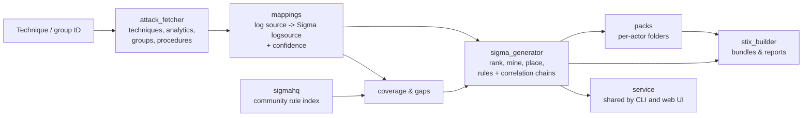

# sigma-generator

**MITRE ATT&CK in, detection engineering out.** Give it a technique, a threat group or a piece of malware.
It produces draft Sigma rules, **correlation rules** (attack chains and count thresholds), a **gap analysis against
SigmaHQ's community rules**, and STIX 2.1 bundles ready for a threat-intel platform. Every rule is **graded for
quality**, so you know which drafts are worth tuning into alerts and which are hunting queries. Use it from the
command line or a local web UI.

```bash
python -m src.main generate --group APT29 --chains
```

```text
Detection pack for APT29 (G0016): 66 technique(s) attributed by ATT&CK
  58 Sigma rule(s), 26 correlation rule(s) for 58 technique(s)
  Quality: 14 strong, 39 moderate, 31 weak
  SigmaHQ r2026-07-01: no existing rule for 13 of these techniques
  2 technique(s) skipped: ATT&CK gives no concrete values (--include-skeletons writes skeletons)
  Folder: output/packs/g0016_apt29
```

> **These are drafts.** Detection values are mined from ATT&CK's data and prose, not from your telemetry. Every
> file ships as `status: experimental` with a banner explaining where each part came from, how strong it is and
> what to check. Treat them as a detection engineer's head start, not something to deploy as-is.

---

## What makes it different

| | What it does | Why it matters |
|---|---|---|
| **Correlation rules** | Turns ATT&CK analytics that describe multi-step behaviour (*"opens LSASS, then runs a dump command"*) into `temporal` rules, and volume (*"a high volume of failed logons"*) into `event_count` / `value_count` rules, using the time window ATT&CK itself suggests | SigmaHQ's release r2026-07-01 contains 3,302 rules and **no correlation rules at all** |
| **Honest quality grading** | Grades every rule strong, moderate or weak by its behavioural content. Weak rules are tagged `detection.threat-hunting` and capped at level `low`. Techniques with no concrete values get no rule at all. | A generator that writes a rule for everything mostly writes noise. This one says which drafts are alert material. |
| **SigmaHQ gap check** | For a technique or a whole threat group, shows which log sources ATT&CK recommends that **no SigmaHQ rule watches**, and can draft rules only for those gaps (`--gaps-only`) | Complements the community rule set instead of duplicating it |
| **Threat detection packs** | `--group APT29`, `--software Mimikatz` or `--campaign C0024` builds a detection for every attributed technique, **mining that group's own documented procedures first** | Turns threat intelligence straight into a reviewable detection backlog |
| **ATT&CK v18+ detection model** | Reads ATT&CK's *detection strategies* and *analytics*, the concrete log sources MITRE now publishes, not the old free-text data sources | The logsource comes from what MITRE says to monitor, with a stated confidence |
| **Local web UI** | `python -m src.main ui`: search, preview, validate and download everything in a browser | Hardened like a security tool should be: localhost-only, strict CSP, CSRF and DNS-rebinding protection |

No AI model is involved. The pipeline is rule-based and deterministic, and every decision is written into the
output.

---

## Use it in your browser

**https://kushagra-patel1011.github.io/sigma-generator/** - no install, no clone, no server.

The same generator runs inside the page, compiled to WebAssembly: ATT&CK data and the code are
downloaded once (about 14 MB, cached afterwards) and every rule is built on your own machine.
Nothing you type is sent anywhere, and the site has no backend to send it to.

The browser build is the page below, with two differences: it cannot write to your output folder
(use the download buttons), and its SigmaHQ index is fixed at build time.

---

## Quick start

Requires Python 3.9+.

```bash
pip install -r requirements.txt
```

```bash
python -m src.main update
```

`update` downloads the newest Enterprise ATT&CK bundle (~55 MB) and SigmaHQ's latest rule release (~3 MB, indexed
locally). Then choose how you want to work:

```bash
python -m src.main ui
```

```bash
python -m src.main generate T1003.001 --chains
```

Rules are written to `output/sigma/`, bundles to `output/stix/` and packs to `output/packs/<name>/`. To get a
`sigma-gen` command instead of `python -m src.main`, run `pip install -e .`.

---

## The web UI

```bash
python -m src.main ui
```

This opens `http://127.0.0.1:8765/`, which has two modes:

- **Technique**
  1. Search ATT&CK and pick a technique.
  2. See every log source MITRE recommends, how each maps to Sigma and with what confidence, and whether SigmaHQ
     already covers it.
  3. Generate rules and correlation rules, each validated on the spot (with pySigma when installed) and shown
     with its quality tier and the reasons for it.
  4. Copy or download them, or save them to the output folder.
- **Threat pack**
  1. Pick a group, piece of software or campaign.
  2. Build the whole pack: summary tiles (including the strong / moderate / weak split), a technique table you
     can filter to deployable rules, SigmaHQ coverage, and expandable rule previews.
  3. Download it as a ZIP or save it to the output folder.

The UI uses only the Python standard library and loads nothing from the Internet. Because it can write files, it is
locked down:

- binds to `127.0.0.1` by default, and warns if you bind elsewhere
- rejects requests whose `Host` header isn't the server itself, which blocks DNS rebinding
- POST requests need `Content-Type: application/json` plus a custom `X-Requested-With` header, which cross-site
  forms and requests can't send, which blocks CSRF
- request bodies are capped at 64 KB, every field is type-checked, and stalled clients time out after 60 seconds
- sends a strict Content-Security-Policy with no inline scripts, plus `nosniff` and `frame-ancestors 'none'`
- serves only three known static files, so no path is taken from the URL
- the page inserts ATT&CK and rule text with `textContent`, never `innerHTML`

Options: `--port 8766`, `--no-browser`, `--offline`.

---

## Features in depth

### Attack-chain correlation rules

```bash
python -m src.main generate T1003.001 --chains
```

ATT&CK analytic AN1030 describes LSASS credential dumping across five log sources. The generator builds one
Sigma correlation file: the correlation rule first, then a named base rule per step, as the
[Sigma correlation specification](https://github.com/SigmaHQ/sigma-specification) lays out.

```yaml
title: Potential LSASS Memory Attack Chain Via 3 Correlated Log Sources
status: experimental
tags:
    - attack.credential-access
    - attack.t1003
    - attack.t1003.001
correlation:
    type: temporal
    rules:
        - step1_process_access
        - step2_process_creation
        - step3_registry_set
    group-by:
        - Computer
    timespan: 5m          # from ATT&CK: "time between LSASS access and dump file creation ... (e.g., 5 minutes)"
level: critical
---
name: step1_process_access
logsource:
    category: process_access
    product: windows
detection:
    selection_target:
        TargetImage|endswith:
            - '\lsass.exe'
    selection_indicator_source:
        SourceImage|endswith:
            - '\mimikatz.exe'
            - '\procdump.exe'
            - '\rundll32.exe'
            - '\werfault.exe'
    selection_indicator_access:
        GrantedAccess:
            - '0x1f0fff'
    condition: selection_target and 1 of selection_indicator_*
---
name: step2_process_creation
logsource:
    category: process_creation
    product: windows
detection:
    selection_indicator_content:
        CommandLine|contains:
            - comsvcs.dll
            - Invoke-Mimikatz
    condition: selection_indicator_content
---
# ... step 3: a write under \SYSTEM\CurrentControlSet\Control\Lsa\Security Packages
```

How a chain is built:

- **Every step carries its own evidence.** Values are claimed once: `lsass.exe` belongs to the process-access
  step, so it is not repeated as command-line text in the next one. Subject values (the registry key, the
  accessed process, the file) are claimed first, by the step whose telemetry records them.
- **Steps must be behavioural.** A step left with only its event type or only generic values is dropped. The
  dump-file step above was dropped because its only values were a Windows DLL's path (used by the attack, not
  written by it) and a generic folder. With fewer than two steps left, no chain is produced.
- **The time window comes from ATT&CK** wherever the analytic's tuning notes state one, taking the upper bound of a
  range. Values over 24 hours are rejected as thresholds rather than windows, and a stated default of `10m` is used
  otherwise.
- **Grouping** is by host (`Computer` on Windows) or by account for cloud logs. A host-scoped step is never
  correlated with an account-scoped one.
- **The level** is raised one step above the single-event rule, as the spec intends for correlations.
- **Ordering:** the type is `temporal`. When ATT&CK describes an order ("subsequently", "followed by"), the banner
  suggests switching to `temporal_ordered` once confirmed.
- **Validation:** every chain is checked with pySigma, which resolves the rule references.

### Count-based correlation rules

```bash
python -m src.main generate T1110.003 --chains
```

Password spraying isn't one suspicious event. It is many ordinary failures. Where ATT&CK describes volume, the
generator writes a threshold rule over the counted base event:

```yaml
correlation:
    type: value_count
    rules:
        - base_security            # EventID 4625, 4771, 4648
    group-by:
        - IpAddress
    timespan: 10m                  # from ATT&CK: "Window over which the correlation is measured (e.g., 10 mins)"
    condition:
        field: TargetUserName
        gte: 5
```

- **`value_count` or `event_count`.** "Different accounts", "unique destination IPs" and similar wording count
  distinct values of that field. Otherwise matching events are counted per account or host.
- **Volume has to mean an amount of activity.** "A high volume of failed logons", "number of unique destinations"
  and knob names such as `ScanRateThreshold` qualify. Disk volumes (`/Volumes/`), "frequently abused", byte rates
  (`OutboundDataRateThreshold`) and amounts described as benign ("allowlist of high-volume domains") don't.
- **Thresholds** come from ATT&CK's text when it states one ("more than 20 failed logons"). Otherwise a default
  of 10 events or 5 distinct values is used, and the banner says so.
- **Only where counting adds something.** A base rule that is already specific gets a threshold only when its own
  log source's ATT&CK text talks about volume.

### Rule quality

Every rule, chain step and count rule is graded by what its detection block actually contains:

| Tier | What it has | What the generator does |
|---|---|---|
| **strong** | two or more selections with specific values | level follows the ATT&CK tactic |
| **moderate** | one subject selection (a registry key, an accessed process, a file, a port) or several specific values | level lowered one step |
| **weak** | only the event type, one value, or only values common in normal activity (`powershell.exe`, `/bin/bash`, `C:\Windows\Temp`) | tagged `detection.threat-hunting`, level capped at `low` |
| *no values* | nothing concrete in ATT&CK | **no rule**, and the technique is reported as skipped. `--include-skeletons` writes a `status: unsupported` skeleton with a `TODO` selection that matches nothing. |

Selection also works against noise:

- **Deployable candidates win.** Among an analytic's log sources, strong and moderate rules beat weak ones. Between
  deployable ones, the telemetry ATT&CK named most precisely decides.
- **Generic alternatives are dropped.** In `[/etc/passwd, /bin/bash]` each value matches on its own, so `/bin/bash`
  is removed and the banner says why. Generic values stay when another part of the rule is specific
  (`SourceImage: rundll32.exe` next to `TargetImage: lsass.exe`).
- **Software packs stay on the software's platforms.** ATT&CK lists Mimikatz as Windows-only, so its pack never
  gets a Linux rule, even when a Linux analytic scores higher. Where no analytic fits, the rule says so.

```bash
python -m src.main quality --group APT29
```

The `quality` command grades techniques without writing files (`--details` for a per-technique table, `--json`
for automation).

### SigmaHQ gap analysis

```bash
python -m src.main gaps T1621
```

```text
T1621 Multi-Factor Authentication Request Generation
  SigmaHQ rules tagged T1621: 2 (+0 on the parent/sub-techniques)
  ATT&CK-recommended telemetry covered: 1/7  -> partial
    AN0449  azure:signinlogs (Multiple MFA challenge reque -> azure/signinlogs    covered by 2 rule(s)
    AN0449  NSM:Connections (PushNotificationSent)         -> zeek/conn           GAP
    AN0450  AWS:CloudTrail (AssumeRole or ConsoleLogin wit -> aws/cloudtrail      GAP
    AN0451  WinEventLog:Security (EventCode=4625)          -> windows/security    GAP
    AN0452  auditd:AUTH (pam_unix or pam_google_authentica -> linux/auditd        GAP
    AN0453  saas:okta (MFAChallengeIssued)                 -> okta/okta           GAP
    AN0454  macos:unifiedlog (authd generating multiple MF -> macos/unifiedlog    GAP
  Fill the gaps:  python -m src.main generate T1621 --gaps-only
```

MFA fatigue is a good example. SigmaHQ's rules for it only watch Azure sign-in logs, while ATT&CK recommends
watching seven kinds of telemetry.

How coverage is decided:

- A SigmaHQ rule covers a recommended log source when it is tagged with the technique and watches the same Sigma
  logsource.
- `registry_event` counts as covering the specific registry categories.
- For Windows service logs, the `EventID`s must overlap.
- For a technique, the report also counts rules tagged with its parent or sub-techniques.

To check a whole group at once:

```bash
python -m src.main gaps --group APT29
```

`--gaps-only` generates rules only on uncovered telemetry. Techniques SigmaHQ fully covers are reported and skipped.
Correlation rules are still generated, because SigmaHQ has none.

### Threat detection packs

```bash
python -m src.main generate --software Mimikatz --chains
```

The generator resolves the group, software or campaign by ATT&CK ID, name or alias: `"Cozy Bear"` finds APT29.
Add `--with-campaigns` to also pull in techniques from campaigns attributed to a group.

For every technique it builds:

- a rule that mines the actor's **procedure examples** first, which is ATT&CK's most concrete text, for example
  *"APT29 has used encoded PowerShell scripts..."*
- the Sigma group or software tag (`attack.g0016`, `attack.s0002`)
- correlation rules where ATT&CK describes multi-step behaviour or volume
- a quality tier for each rule, and for software, rules restricted to the platforms it runs on
- a SigmaHQ coverage verdict

Output lands in one folder:

```text
output/packs/s0002_mimikatz/
├── README.md                     summary: quality split, then technique, rules, correlations, SigmaHQ, status
├── pack.json                     the same, machine-readable
├── s0002_mimikatz_bundle.json    STIX 2.1: tool, techniques, MITRE's `uses` relationships,
│                                 one indicator per rule, and a `report` tying the pack together
└── sigma/                        one rule per technique; mr_*.yml are correlation rules (mr_*_count_* thresholds)
```

### Single-technique rules

The core engine, which everything above builds on:

**1. Resolve telemetry through four tiers of evidence.** The tier used becomes the rule's stated confidence and the
STIX indicator's `confidence`.

| Evidence ATT&CK gave | Example | Confidence |
|---|---|---|
| Log source and event ID | Sysmon `EventCode=13` -> `registry_set` | 0.95 |
| Log source only | `AWS:CloudTrail` -> `product: aws / service: cloudtrail` | 0.75 |
| Data component only | `Module Load` -> `image_load` | 0.55 |
| Platform only | `IaaS` -> CloudTrail | 0.25 |

**2. Pick the best log source.** Candidates are ranked by confidence, then ATT&CK's own ordering, then how much of
the mined content the source can express. With no `--platform`, the best-supported platform wins. ATT&CK lists
platforms alphabetically, so taking the first one would favour ESXi over Windows.

**3. Put values in the fields where the telemetry records them:**

- `lsass.exe` is a `TargetImage` in process-access events, but `CommandLine` text in process creation
  (`procdump -ma lsass.exe`).
- Run-key rules don't require `reg.exe`, since most malware writes keys through the API.
- Windows tools never land in Linux rules, and the reverse.
- Registry hives are dropped (Sysmon records `HKU\<SID>\...`).
- `%APPDATA%` expands to `\AppData\Roaming`.
- ATT&CK's placeholder names (`example.dll`) are ignored.

**4. Refuse rather than bluff.** Techniques whose telemetry lives outside a defender's logs, such as Internet scans
or malware repositories, are reported as unmappable. Where ATT&CK names the telemetry but no concrete value to
match, no rule is written: the technique is listed as skipped, and `--include-skeletons` writes a clearly marked
skeleton instead. There is no keyword-search fallback, because a rule that matches words from ATT&CK's prose
detects nothing.

---

## Measured against ATT&CK Enterprise v19.2 and SigmaHQ r2026-07-01

Across all 697 active techniques, the best rule for each:

| | |
|---|---|
| Analytic log-source references resolved to a Sigma logsource | **98.5%** (4,098 of 4,160) |
| Techniques that get a rule | **556**. 66 are skipped because ATT&CK names no concrete value; 75 are unmappable because their telemetry lives outside a defender's logs |
| Quality of those 556 rules | **130 strong (23%), 195 moderate (35%), 231 weak (42%)** |
| Deployable (strong or moderate) | **325 of 697 techniques (46.6%)** |
| Rules backed by an exact ATT&CK event reference | 445 of 556 |
| Correlation rules (`--all-analytics`) | **232** across 186 techniques: 110 attack chains, 112 `event_count`, 10 `value_count` |
| Attack chains with a value repeated between steps | **0** |
| Group detection packs | 176 groups: 4,036 rules and 1,892 correlation rules |
| Software packs with a rule outside the software's platforms | 102 of 10,311 rules, every one flagged in its banner (no analytic exists for the software's platform) |
| Generated files failing validation or **pySigma** | **0**, across every rule and correlation rule and all 5,928 group-pack files |

How the grading changed the output (v1.1 against now):

| | v1.1 | now |
|---|---|---|
| Rules written | 622 | 556 |
| Rules that were only a keyword search of ATT&CK's prose | 165 (27%) | 0 |
| Broad rules marked as hunting queries | none (no grading) | all 231 weak rules: `detection.threat-hunting`, level `low` |
| Attack chains whose steps repeated the same values | 88% | 0% |

---

## Commands

| Command | Purpose |
|---|---|
| `generate T1003.001 [...]` | Rules and STIX bundles for techniques |
| `generate --group/--software/--campaign NAME` | A detection pack |
| `gaps T1003.001` / `gaps --group NAME` | SigmaHQ coverage of ATT&CK's recommended telemetry |
| `quality [T1003.001 ...]` / `quality --group NAME` | Grade techniques strong, moderate, weak or no values without writing files (`--details`, `--json`) |
| `info T1003.001` / `info G0016` | What ATT&CK knows about a technique, group, software or campaign (`--json`) |
| `search QUERY [--groups/--software/--campaigns]` | Find IDs |
| `update [--attack-only/--sigmahq-only]` | Refresh the ATT&CK bundle and SigmaHQ index |
| `validate PATH` | Check Sigma rules, correlation files and STIX bundles (uses pySigma when installed) |
| `ui [--port N] [--no-browser]` | Start the local web interface |

`generate` flags:

| Flag | Effect |
|---|---|
| `--chains` | Also build correlation rules: attack chains and count thresholds |
| `--include-skeletons` | Write `status: unsupported` skeletons for techniques with no concrete values instead of skipping them |
| `--gaps-only` | Only generate for telemetry SigmaHQ doesn't cover |
| `--with-campaigns` | For a group, include techniques from attributed campaigns |
| `--platform Windows` / `--analytic AN1030` | Restrict to one ATT&CK platform or analytic |
| `--all-analytics` / `--max-rules N` | One rule per analytic instead of only the best one |
| `--from-file ids.txt` | Read technique IDs from a file |
| `--stdout`, `--no-sigma`, `--no-stix`, `--merge-stix`, `--no-banner` | Control what is written where |
| `--author`, `--status`, `--level`, `--tlp` | Rule and bundle metadata |
| `--deterministic` | UUIDv5 IDs, so repeated runs are byte-identical |
| `--strict` | Exit with code 3 if anything fails validation |
| `--keep-revoked` | Generate for a revoked ID instead of its replacement |

Common to all commands: `--data PATH`, `--sigmahq PATH`, `--offline`, `-v/-vv`, `-q`.

---

## Output formats

**Sigma rule.** A provenance banner, then a SigmaHQ-style rule with 4-space indentation, current ATT&CK tactic tags
and `selection_*` naming. *Required* selections (the event type, the registry key written, the process accessed)
are AND-ed. *Indicator* selections (`selection_indicator_*`) are alternative signs of malice and are OR-ed.

**Correlation file (`mr_*.yml`).** One multi-document YAML file: the correlation rule, then its named base rules.
Base rules carry no metadata, as the spec requires. `_count_` in the file name marks a threshold rule
(`event_count` / `value_count`) rather than an attack chain.

**Banner.** Every file starts with a comment block stating the ATT&CK analytic, the telemetry and its confidence,
the quality tier and why, what was mined, ATT&CK's tuning knobs, anything left out on purpose, and a checklist to
work through before deploying.

**STIX 2.1 bundle:**

| Object | Purpose |
|---|---|
| `indicator` | `pattern_type: sigma`, and `pattern` holds the rule or whole correlation file. Its UUID is the Sigma rule's UUID, and its labels include the quality tier (`quality.strong`). |
| `attack-pattern` | A faithful subset of MITRE's object, **keeping MITRE's STIX ID**, so a threat-intel platform deduplicates it against its ATT&CK feed |
| `relationship` | `indicator --indicates--> attack-pattern`, the relationship the STIX 2.1 spec defines for this pair |
| `intrusion-set` / `tool` / `malware` / `campaign` | In packs: the actor, with MITRE's `uses` relationships and procedure descriptions |
| `report` | In packs: one browsable item referencing everything |
| `identity`, `marking-definition` | Author and TLP marking, taken verbatim from the STIX 2.1 specification |

---

## Configuration

Copy `.env.example` to `.env`. Every value is optional, and command-line flags take precedence.

| Variable | Default |
|---|---|
| `ATTACK_DATA_PATH` / `ATTACK_DATA_URL` / `ATTACK_INDEX_URL` | `data/enterprise-attack.json` / newest release / MITRE's index |
| `SIGMAHQ_INDEX_PATH` / `SIGMAHQ_RELEASE_URL` | `data/sigmahq-index.json` / SigmaHQ's latest `sigma_all_rules.zip` |
| `ATTACK_HTTP_TIMEOUT` | `60` |
| `SIGMA_AUTHOR` / `SIGMA_STATUS` / `SIGMA_OUTPUT_DIR` | `sigma-generator` / `experimental` / `output` |
| `STIX_IDENTITY_NAME` / `STIX_TLP` | `sigma-generator` / `amber` |

`src/templates/sigma_template.yml` is read at runtime:

- **Key order** controls the field order of rendered rules.
- **Concrete values** (`status`, `author`, `falsepositives`, `level`) become defaults.
- **`<placeholder>` values** are filled in by the generator.

`level` ships as a placeholder so it follows the ATT&CK tactic. Write `level: high` to pin every rule to `high`.

---

## How it works



| Module | Responsibility |
|---|---|
| `src/attack_fetcher.py` | Downloads, caches and indexes ATT&CK: techniques, detection strategies, analytics, groups, software, campaigns, procedures and revocations |
| `src/mappings.py` | The ATT&CK-telemetry-to-Sigma table: Sysmon, Windows Security/System/PowerShell, auditd, macOS, Zeek, AWS/Azure/GCP/M365/Okta/GitHub/Kubernetes, network devices, ESXi, plus fallbacks |
| `src/sigma_generator.py` | Candidate ranking, artefact placement, rule and correlation-chain assembly, provenance banners, Sigma and correlation validation |
| `src/sigmahq.py` | SigmaHQ release download and index, coverage matching, gap reports |
| `src/packs.py` | Group, software and campaign detection packs: generation, README, JSON and files |
| `src/stix_builder.py` | Technique and pack bundles, TLP markings, merging, STIX validation |
| `src/service.py` | One service layer used by both the CLI and the web UI |
| `src/web/` | Standard-library HTTP server and a dependency-free single-page app |
| `src/main.py` | The CLI |
| `tools/corpus.py` | Corpus snapshot: every technique's output digested and compared with a committed baseline |
| `tools/webapp.py` | Builds the browser version of the UI (trimmed ATT&CK data + wheel + Pyodide runtime) |

---

## Tests

```bash
pip install -r requirements-dev.txt
```

```bash
python -m pytest
```

The unit tests run offline against small fixtures under `tests/fixtures/`:

- **ATT&CK:** a slice of v19.2, including APT29, Mimikatz and the SolarWinds campaign, plus one technique rewritten
  into the pre-v18 shape.
- **SigmaHQ:** 168 real SigmaHQ index entries.

The tests cover:

- text mining and normalisation
- every telemetry tier and artefact placement
- rules, correlation chains, count rules and gap analysis
- rule quality: tiers, skeletons, generic-value pruning, volume wording, software platforms and the `quality`
  command, largely on small synthetic ATT&CK analytics so each behaviour is pinned down on its own
- packs and STIX bundles
- both validators
- the CLI end to end
- the web UI's API and its security controls: CSRF, Host header, content type, body size and static-file allowlist

### Corpus snapshot

The unit tests pin behaviours one at a time. The corpus snapshot pins the whole output: every active technique in
ATT&CK 19.2 (pinned by sha256), every analytic's rule, chain and count rule, reduced to a digest of quality tier,
level, logsource, selection fields and values, condition, correlation type, threshold, time window and group-by.
The digest is committed at `tests/corpus/baseline.json`, and any change to it is reported technique by technique.

```bash
python -m tools.corpus fetch      # download the pinned ATT&CK bundle once (~55 MB, into data/corpus/)
python -m pytest -m corpus        # or: python -m tools.corpus check
python -m tools.corpus bless      # print the drift, then accept it as the new baseline
```

It is excluded from the default `pytest` run and runs as its own CI job. Re-bless only when a change to generated
content is intended, and commit the baseline with the change so the drift is reviewed with the code that caused it.

---

## Limitations

- **Content is mined from prose.** ATT&CK names tools and paths as examples, not complete lists. Expect to add
  values and filters from your own telemetry.
- **Field names follow the SigmaHQ taxonomy**, which is Sysmon-shaped on Windows. A few logsources ATT&CK names have
  no SigmaHQ standard (osquery, ESXi, Docker, some SaaS). Those rules say so in their banner.
- **Correlations need backend support.** Not every SIEM backend can convert Sigma correlation rules. The `group-by`
  field (`Computer` or `host`) must exist in every step's events.
- **Coverage matching is logsource-level.** "Covered" means SigmaHQ has a rule for the technique on that telemetry,
  not that the rule catches every variant.
- **Quality tiers measure content, not accuracy.** "Strong" means two independent signals were found in ATT&CK, not
  that the rule was tested against attacks. Every tier still needs validation against real telemetry.
- **A `temporal` chain needs every step.** Where ATT&CK says a dump *or* a registry change follows, remove the
  steps your environment won't see before deploying.
- **Levels are a heuristic**: the tactic, lowered for moderate and weak rules, raised for correlations.
- **TLP markings** use the TLP v1 definitions from the STIX 2.1 specification. `--tlp clear` maps to `white`.

## License

MIT - see [LICENSE](LICENSE). The rules this tool generates are yours; they carry no licence of their own.

## Attribution

MITRE ATT&CK® data is © The MITRE Corporation, used under the
[ATT&CK Terms of Use](https://attack.mitre.org/resources/legal-and-branding/terms-of-use/). Sigma and the SigmaHQ
rule set are maintained by the [SigmaHQ](https://github.com/SigmaHQ) project; SigmaHQ rules are licensed under the
[Detection Rule License 1.1](https://github.com/SigmaHQ/Detection-Rule-License).

This tool downloads SigmaHQ's release and indexes rule metadata (ID, title, path, status, level, logsource,
ATT&CK tags, EventIDs) locally for coverage analysis. No rule detection logic is redistributed. The test fixture
`tests/fixtures/mini-sigmahq-index.json` contains metadata for 168 SigmaHQ rules, credited here.
