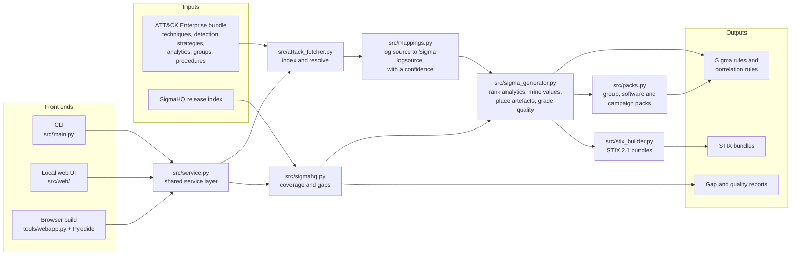
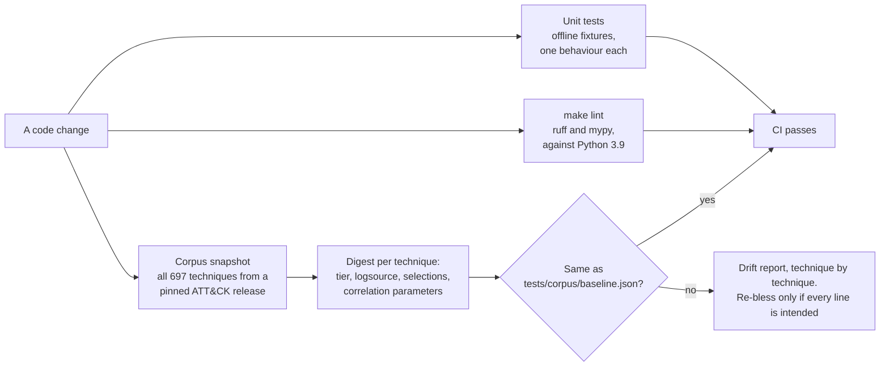
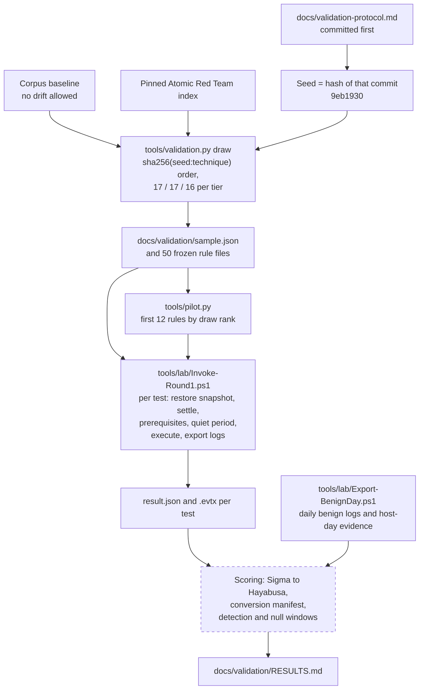

# Architecture

sigma-generator is one Python engine behind three front ends. It is rule-based and deterministic: no model is
called at runtime, and every decision is written into the banner of the rule it produced.

## Generation

| Module | Responsibility |
|---|---|
| `src/attack_fetcher.py` | Downloads and indexes ATT&CK: techniques, detection strategies, analytics, groups, software, campaigns, procedures |
| `src/mappings.py` | ATT&CK log source to Sigma logsource, with a confidence and per-field roles |
| `src/sigma_generator.py` | Candidate ranking, artefact placement, quality grading, rules and correlation rules, validation |
| `src/sigmahq.py` | SigmaHQ release index, and coverage and gap analysis |
| `src/packs.py` | Threat detection packs |
| `src/stix_builder.py` | STIX 2.1 bundles and reports |
| `src/service.py` | The layer every front end calls, so a rule from the browser is the rule the CLI writes |

## How correctness is guarded

CI runs the unit tests and the corpus snapshot on Python 3.9 and 3.13, and ruff and mypy on Python 3.11.

## Validation (pre-registered, not executed)

Dashed boxes are not built yet.

The protocol fixes the sample, the meaning of "detected" and the criteria that would show the tiers are wrong
before any test runs. The pilot is the first slice of that same run. [RESULTS.md](validation/RESULTS.md) lists
the commands for the Windows lab host and the files to copy back.

## Related

- [README](../README.md): usage, features and measured output
- [Case study](case-study.md): problem, constraints, and problems caught before they shipped
- [Validation protocol](validation-protocol.md), [pilot plan](validation/pilot-plan.md),
  [lab build sheet](validation/lab-build.md)
